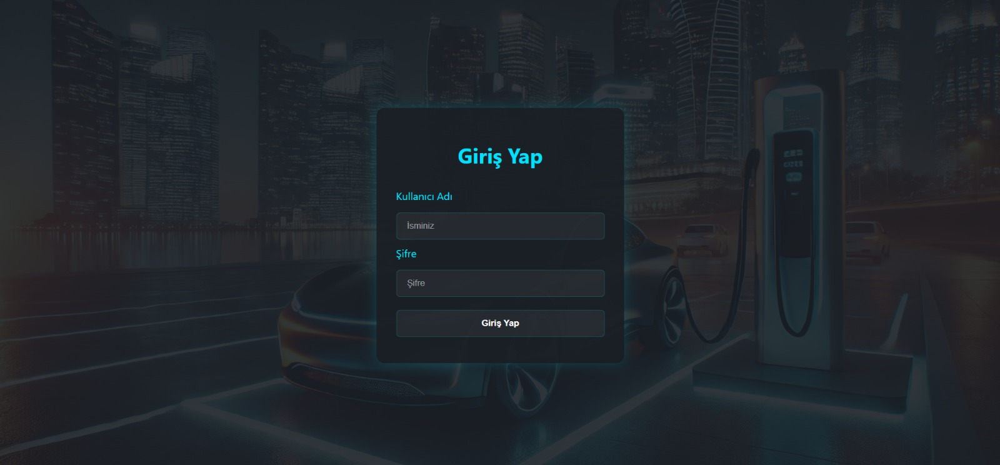
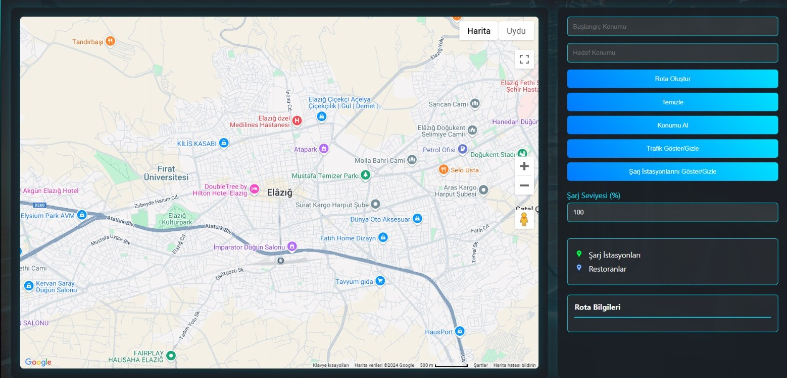
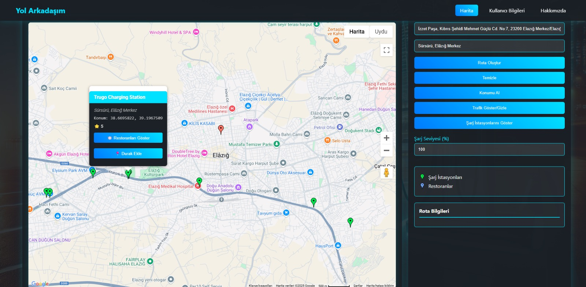
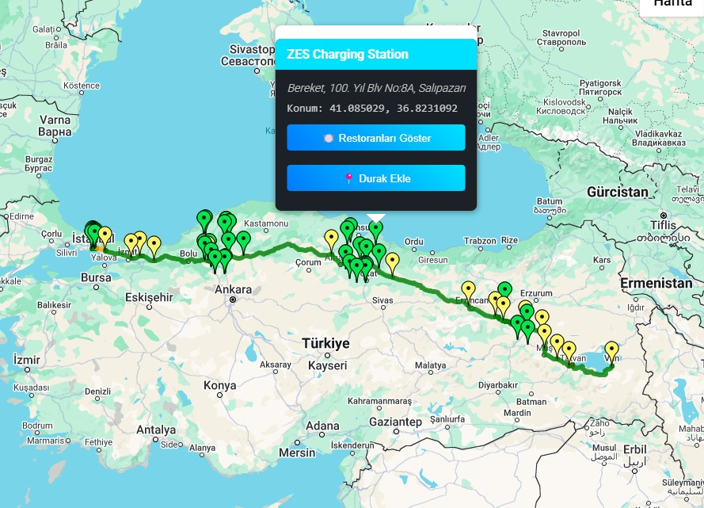
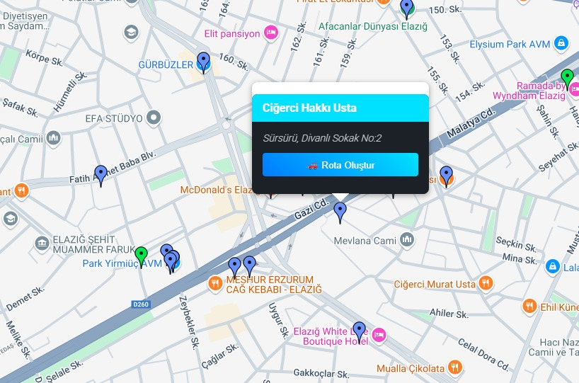
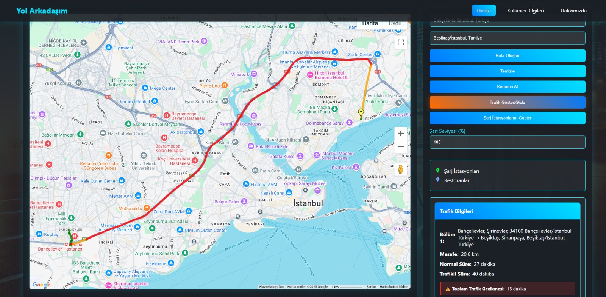
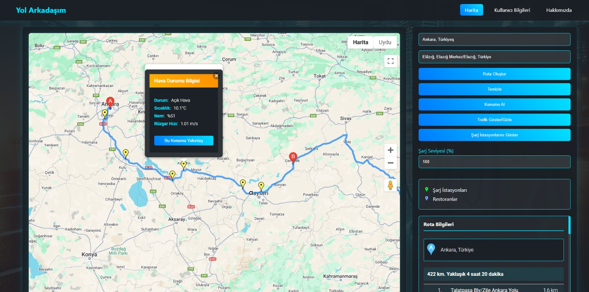
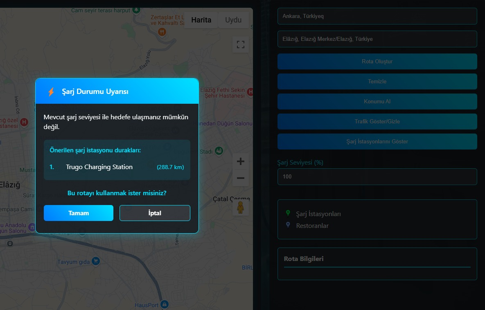
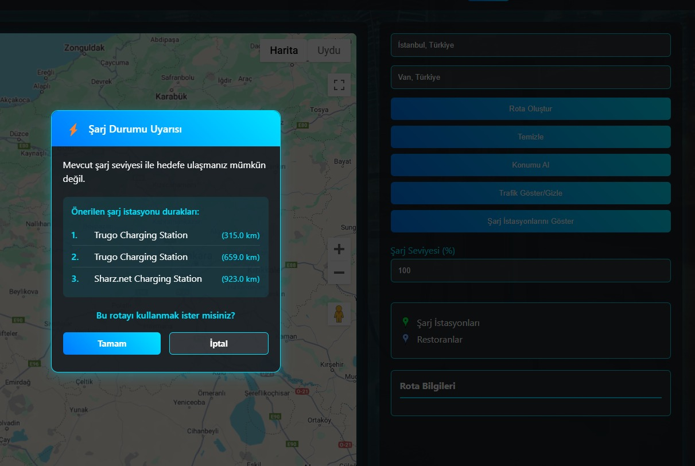
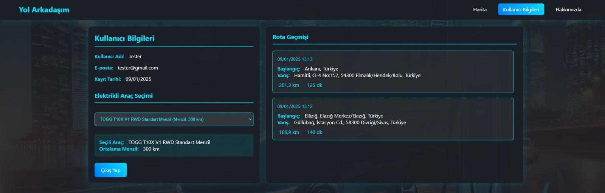

# Yol Arkadaşım - Elektrikli Araç Rota Planlayıcı

Geliştirici Ekip:

Muhammed Yusuf Karaman (Scrum Master)
Asım Eren Kurt
İsmail Mete Karasubaşı
Mustafa Oğuzhan Örs

## 📝 Proje Hakkında
Yol Arkadaşım, elektrikli araç kullanıcıları için geliştirilmiş kapsamlı bir rota planlama ve şarj istasyonu bulma uygulamasıdır. 
Uygulama, kullanıcıların seyahatlerini optimize etmelerine ve yol üzerindeki şarj istasyonlarını kolayca bulmalarına yardımcı olur.

### 🚗 Temel Özellikler
- Akıllı Rota Planlama: Başlangıç ve varış noktaları arasında optimal rota hesaplama
- Şarj İstasyonu Konumları: Rota üzerindeki ve yakındaki şarj istasyonlarını görüntüleme
- Gerçek Zamanlı Trafik Bilgisi: Canlı trafik verilerini gösterme ve alternatif rotalar sunma
- Hava Durumu Entegrasyonu: Rota üzerindeki hava durumu bilgilerini gösterme
- Menzil Hesaplama: Araç şarj durumuna göre menzil hesaplama ve uyarı sistemi
- Yakındaki Mekanlar: Şarj istasyonları çevresindeki restoran ve dinlenme noktalarını listeleme

------------------------------------------------------

### Giriş Sayfası

  

-----------------------------------------------------

### Harita Sayfası

  

-----------------------------------------------------

### Şarj İstasyonu Gösterimi

  

-----------------------------------------------------

### Rota Üzerinde Şarj İstasyonu Gösterimi

  

-----------------------------------------------------

### İstasyon Çevresi Restoran Gösterimi

  

-----------------------------------------------------

### Trafik Durumu Gösterimi

  

-----------------------------------------------------

### Hava Durumu Gösterimi

  

-----------------------------------------------------

### Şarj İstasyonu Önerisi

  

-----------------------------------------------------

### Uzun Rotada Şarj İstasyonu Önerisi

  

-----------------------------------------------------

### Kullanıcı Bilgileri Sayfası

  

-----------------------------------------------------

### 🛠 Kullanılan Teknolojiler
- Frontend: HTML, CSS, JavaScript
- Backend: Django (Python)
- Harita API: Google Maps JavaScript API
- Diğer API'ler: 
  - Google Places API
  - OpenWeather API
  - Google Distance Matrix API

## 🚀 Kurulum
1. Repoyu klonlayın: git clone https://github.com/Apeiron02/Yolarkprojesi.git
2. Gerekli Python paketlerini yükleyin: pip install -r requirements.txt
3. Ortam değişkenlerini ayarlayın:
- SECRET_KEY='YOUR_DJANGO_KEY'
- DEBUG=True
- OPENWEATHER_API_KEY='YOUR_WEATHER_API_KEY'
- GOOGLE_PLACES_API_KEY='YOUR_GOOGLE_API_KEY'
- DATABASE_NAME='YOUR_DATABASE_NAME'
- DATABASE_USER='YOUR_DATABASE_USERNAME'
- DATABASE_PASSWORD='YOUR_DATABESE_PASSWORD'
- DATABASE_HOST='YOUR_DATABASE_HOST'
- DATABASE_PORT='YOUR_DATABASE_PORT_NUMBER'
- CELERY_BROKER_URL='YOUR_CELERY_BROKER_URL'
4. Django migrations'ları çalıştırın: python manage.py migrate
5. Sunucuyu başlatın: python manage.py runserver

## 💡 Kullanım
1. Uygulamaya giriş yapın veya kayıt olun
2. Ana harita ekranında başlangıç ve varış noktalarını belirleyin
3. Kullanıcı Bilgilerinden aracınızı seçimini yapın
4. Aracınızın mevcut şarj seviyesini girin
5. "Rota Oluştur" butonuna tıklayın
6. Sistem size:
   - Optimal rotayı
   - Şarj istasyonlarını
   - Tahmini varış süresini
   - Hava durumu bilgisini gösterecektir

## 🔍 Önemli Kod Bölümleri

### Harita İşlemleri
javascript:static/js/map.js
- startLine: 17
- endLine: 121
- Bu bölüm, harita başlatma ve temel harita işlemlerini içerir.

### Şarj İstasyonu İşlemleri
javascript:static/js/map.js
- startLine: 124
- endLine: 214
- Şarj istasyonlarının aranması ve görüntülenmesi işlemleri.

### Rota Hesaplama
javascript:static/js/map.js
- startLine: 418
- endLine: 481
- Bu bölüm, kullanıcıların başlangıç ve varış noktalarını belirleyerek rota hesaplamasına olanak tanır.

### Rota Geçerliliği Kontrolü
javascript:static/js/map.js
- startLine: 484
- endLine: 532
- Bu bölüm, checkRouteViability fonksiyonu ile kullanıcıların belirlediği rotanın geçerliliğini kontrol eder. 
Kullanıcının araç bilgilerini ve mevcut pil seviyesini alarak, toplam mesafeyi ve menzil etkilerini hesaplar. 
Trafik ve hava durumu etkilerini göz önünde bulundurarak, rotanın geçerli olup olmadığını belirler. 
Eğer rota geçerli değilse, gerekli şarj duraklarının sayısını hesaplar.

### Trafik Etkisi Hesaplama
javascript:static/js/map.js
- startLine: 534
- endLine: 558
- Bu bölüm, calculateTrafficImpact fonksiyonu ile bir rota bacağının trafik durumunu değerlendirir. 

### Hava Durumu Etkisi Hesaplama
javascript:static/js/map.js
- startLine: 560
- endLine: 598
- Bu bölüm, calculateWeatherImpact fonksiyonu ile bir rota bacağının hava durumu koşullarını değerlendirir.

## 👥 Katkıda Bulunma
1. Bu repoyu fork edin
2. Yeni bir branch oluşturun (git checkout -b feature/yeniOzellik)
3. Değişikliklerinizi commit edin (git commit -am 'Yeni özellik: Detaylar')
4. Branch'inizi push edin (git push origin feature/yeniOzellik)
5. Pull Request oluşturun

## 📄 Lisans
MIT Lisansı

Telif hakkı (c) [2024] [Muhammed Yusuf KARAMAN]

Bir kopyasını edinen herkese, ücretsiz olarak izin verilmiştir.
Bu yazılımın ve ilişkili belge dosyalarının ("Yazılım"),
Yazılımda, sınırlama olmaksızın, haklar dahil olmak üzere, kısıtlama olmaksızın
kullanmak, kopyalamak, değiştirmek, birleştirmek, yayınlamak, dağıtmak, alt lisanslamak ve/veya satmak
Yazılımın kopyalarını ve Yazılımın kendilerine ait olduğu kişilere izin vermek için
Bunu yapmak için, aşağıdaki koşullara tabi olarak sağlanmıştır:

Yukarıdaki telif hakkı bildirimi ve bu izin bildirimi tüm
Yazılımın kopyaları veya önemli bölümleri.

YAZILIM, HERHANGİ BİR TÜRDE AÇIK VEYA GARANTİ OLMADAN "OLDUĞU GİBİ" SAĞLANMAKTADIR
ZIMNİ OLARAK, SATILABİLİRLİK GARANTİLERİ DAHİL ANCAK BUNLARLA SINIRLI OLMAMAK ÜZERE,
BELİRLİ BİR AMACA UYGUNLUK VE İHLAL ETMEME. HİÇBİR DURUMDA
YAZARLAR VEYA TELİF HAKKI SAHİPLERİ HERHANGİ BİR TALEP, ZARAR VEYA DİĞER SORUMLULUKTAN SORUMLU TUTULAMAZ
SÖZLEŞME, HAKSIZ FİİL VEYA BAŞKA BİR ŞEKİLDE OLUŞAN SORUMLULUK,
YAZILIMDAN VEYA YAZILIMIN KULLANIMINDAN VEYA DİĞER İŞLEMLERDEN BAĞLANTILI OLARAK
YAZILIM.
